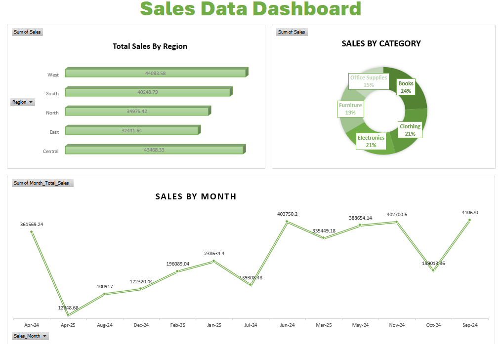

<h1 align="center">📊 Sales Data Dashboard</h1>

<p align="center">
  <b>Interactive Excel Dashboard for Sales Performance Analysis</b><br>
  Built using Microsoft Excel, Pivot Tables, Pivot Charts, and Data Visualization Techniques.
</p>

---

## 🎯 Project Overview

The **Sales Data Dashboard** is a business intelligence project developed in **Microsoft Excel** to transform raw sales data into actionable insights.

The dashboard provides a clear view of:

- 🌍 Regional Sales Performance
- 🛍️ Product Category Analysis
- 📈 Monthly Sales Trends
- 📊 Executive-Level Business Insights

This project demonstrates practical Excel skills commonly used in data analytics and reporting roles.

---

## 📸 Dashboard Preview

> Save your dashboard screenshot as `dashboard.png` inside the repository and uncomment the line below.

```md

```

---

## 🚀 Key Features

### 🌍 Regional Sales Analysis
Analyze total sales generated across different regions:

- West
- South
- North
- East
- Central

**Purpose:** Identify high-performing and low-performing markets.

---

### 🛍️ Category Performance Analysis

Sales distribution across:

| Category | Share |
|-----------|--------|
| 📚 Books | 24% |
| 👕 Clothing | 21% |
| 💻 Electronics | 21% |
| 🪑 Furniture | 19% |
| 🏢 Office Supplies | 15% |

**Purpose:** Understand customer demand and product contribution.

---

### 📈 Monthly Sales Trend Analysis

Track sales fluctuations over time to:

- Identify seasonal patterns
- Detect growth opportunities
- Monitor revenue performance
- Support forecasting decisions

---

## 🛠️ Excel Skills Demonstrated

### Data Analysis
- Pivot Tables
- Data Aggregation
- Business Reporting
- KPI Monitoring

### Data Visualization
- Bar Charts
- Doughnut Charts
- Line Charts
- Interactive Dashboard Design

### Excel Features
- Pivot Charts
- Slicers
- Conditional Formatting
- Data Cleaning
- Dashboard Layout Design

---

## 📊 Business Insights

The dashboard helps answer key business questions:

✔ Which region generates the highest revenue?

✔ Which product category contributes most to sales?

✔ How do monthly sales trends change over time?

✔ Which areas require business improvement?

---

## 📁 Repository Structure

```text
Sales-Data-Dashboard/
│
├── README.md
├── PR 2.xlsx
├── dashboard.png
│
└── Assets/
    └── Screenshots
```

---

## 🎓 Learning Outcomes

Through this project, I gained experience in:

- Data Visualization
- Dashboard Development
- Business Analytics
- Excel Reporting
- Data Interpretation
- Performance Tracking

---

## 💼 Tools Used

| Tool | Purpose |
|--------|---------|
| Microsoft Excel | Data Analysis |
| Pivot Tables | Data Summarization |
| Pivot Charts | Visualization |
| Slicers | Interactive Filtering |
| Dashboard Design | Reporting |

---

## ⭐ Project Highlights

✅ Professional Dashboard Design

✅ Real-World Sales Analysis

✅ Interactive Visualizations

✅ Business-Oriented Insights

✅ Portfolio-Ready Excel Project

---

## 👨‍💻 Author

### Yash Patel

Engineering Student • Excel Analyst • Data Enthusiast

---

<p align="center">
⭐ If you found this project useful, consider giving it a star on GitHub.
</p>
